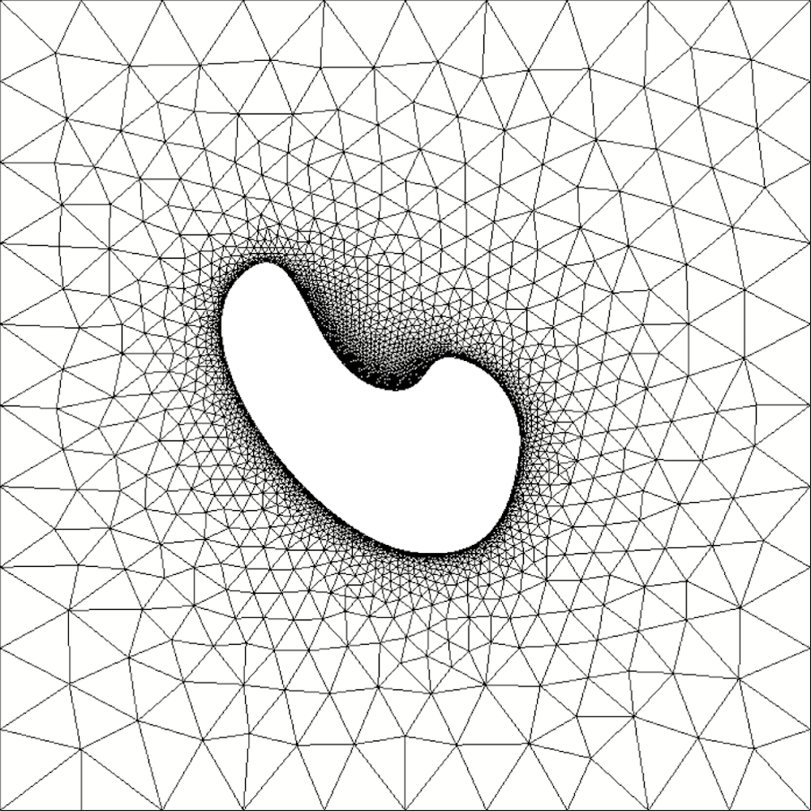
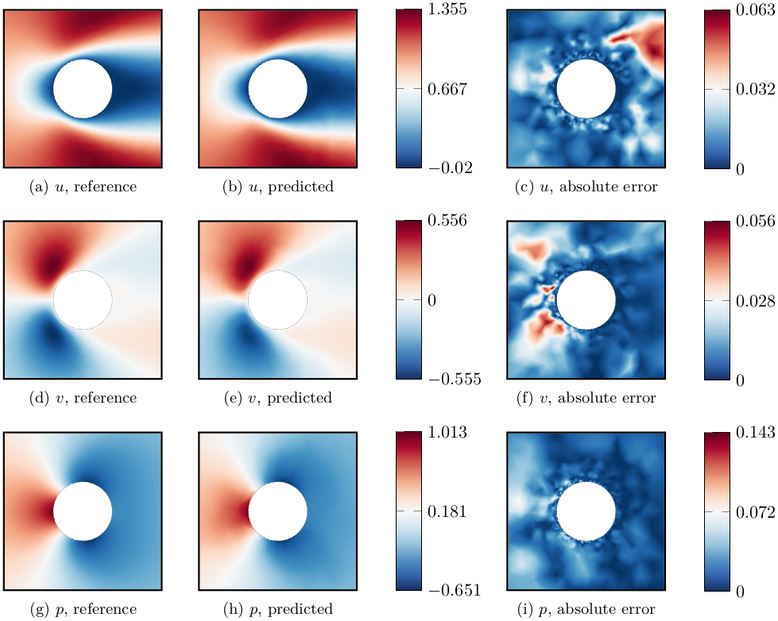

# gnn_laminar_flow

A project concerned with the prediction of laminar velocity and pressure fields from an input shape using graph neural network architectures. If you exploit this work for your own research, please consider citing <a href="">the article</a> or <a href="https://arxiv.org/abs/2107.11529">the pre-print</a>. **This work was produced during the PhD thesis of <a href="https://github.com/junfeng-chen">J. Chen</a>.**

  

The proposed graph convolutional neural network works on triangular meshes, taking the coordinates of nodes and the binary encoding of the solid surface as inputs, and predicts velocity and pressure fields around random 2D shapes at a low Reynolds number. Compared to U-nets, the graph models have higher accuracy and requires fewer trainable parameters, but require an extended training time. In particular, it allows a particularly good resolution of the boundary layer.

  

The dataset contains 2000 random 2D obstacles, together with their laminar velocity and pressure fields, and is available upon request to the authors. It was also used in the following articles:
- J. Viquerat and E. Hachem, "[A supervised neural network for drag prediction of arbitrary 2D shapes in laminar flows at low Reynolds number](https://github.com/jviquerat/cnn_drag_prediction)"
- J. Chen, J. Viquerat and E. Hachem, "[A twin-decoder structure for incompressible laminar flow reconstruction with uncertainty estimation around 2D obstacles](https://github.com/jviquerat/twin_autoencoder)"

## Structure of the repository

- **dataset_utils** : functions concerning the data
- **network_utils** : functions and classes concerning the convolutional blocks and network architecture
- **params** : directions, network hyper-parameters etc..
- **predict** : get the flow prediction and drag force of a cylinder or a NACA0012 airfoil
- **predict_testset**: get the flow prediction and drag force of all the shapes in the test set
- **training** : the main function for training a neural network
- **training_utils** : functions used for custom training loops
- **best_model** : save model parameters during the training process

## Training the model

To train a model, first install the required packages in a dedicated virtual environment, then run `python3 training.py`. Network hyper-parameters can be configured in `params.py`, while the architecture is described in `network_utils.py`. Below is a result sample from the article.

  

